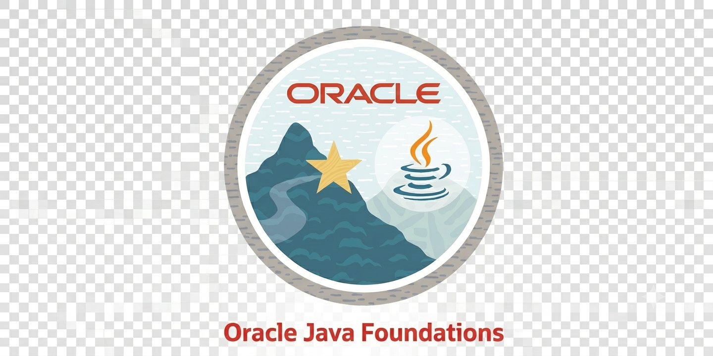

• 🎓 Computer Science student. 
• ☕ Java developer passionate about understanding how software works under the hood. 
• 🏗️ Currently studying Software Architecture, Spring Framework, Docker and Microservices. 
• 🐧 Linux enthusiast (Red Hat & CachyOS). 
• 🌳 Interested in Data Structures, Algorithms, Operating Systems and Databases. 
• 📚 Always learning something new. 

---

## 🚀 Currently Studying

### Backend Development

- Java
- Spring Framework
- Spring Boot
- REST APIs
- Dependency Injection
- JPA / Hibernate

### Software Architecture

- SOLID Principles
- Design Patterns
- Clean Architecture
- Domain Driven Design (DDD)
- Layered Architecture

### Application Design

- Monolithic Applications
- Microservices
- API Design
- Scalability Fundamentals

### DevOps & Workflow

- Docker
- Git
- Git Flow
- Maven

### Computer Science

- Data Structures
- Algorithms
- Operating Systems
- Database Systems

---

## 🛠 Languages and Tools

  
  
  
  
  

  
  
  
  
  

  
  
  

  
  
  

## 🏆 Certifications & Badges

<!--Credly -->

---

## 📫 Contact

---
